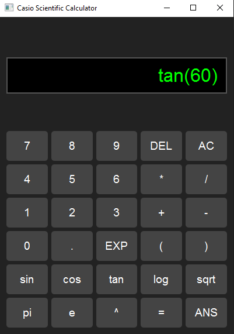

# Casio-Style Scientific Calculator
A professional scientific calculator built using **Python** and **PyQt6** with a sleek Casio-style UI.

## 🚀 Features
✅ Basic operations (+, -, *, /)  
✅ Trigonometry (`sin`, `cos`, `tan`)  
✅ Logarithm (`log10(x)`)  
✅ Square root (`sqrt(x)`)  
✅ Constants: `π`, `e`  
✅ Clean dark mode with a modern look  

## 🛠️ Setup Instructions
```bash
git clone https://github.com/yourusername/Scientific-Calculator.git
cd Scientific-Calculator
python -m venv venv
source venv/bin/activate
pip install -r requirements.txt
python calculator.py
```

## ✅ Test Cases
| Input | Expected Output |
|-------|----------------|
| sin(30) | 0.5 |
| cos(0) | 1.0 |
| tan(45) | 1.0 |
| log(100) | 2.0 |
| sqrt(16) | 4.0 |

## 📜 License
This project is licensed under the [MIT License](LICENSE).
